# Sensor

**Biosignals · Eye tracking · Timing · Provenance**

**11 devices · 2 facial tools · 1 participant · 6 CSVs · 3 summary sessions.** Raw: Session 1.

## Data flow

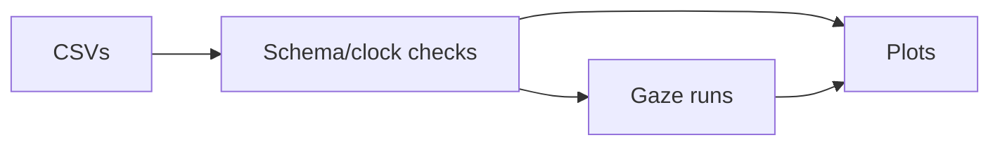

## Data

| CSV | Rows | Content |
| --- | ---: | --- |
| `hr` | 4,032 | HR samples |
| `ibi` | 2,394 | Intervals |
| `sed` | 34,171 | Gaze/pupil |
| `sed_fix` | 34,171 | Runs |
| `eye_metrics` | 264 | Summaries |
| `Psychometric_Test_Results` | 88 | Responses/timing |

[Dictionary](data/DATA_DICTIONARY.md) · [Schema](datapackage.json) · [Notebook](analysis/explore_data.ipynb)

## Equipment

<table>
<tr>
<td align="center" valign="top" width="33%">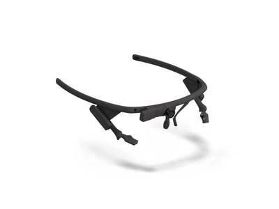<br>Pupil Labs Core</td>
<td align="center" valign="top" width="33%">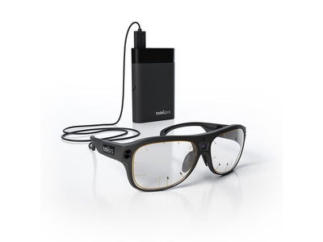<br>Tobii Pro Glasses 3</td>
<td align="center" valign="top" width="33%">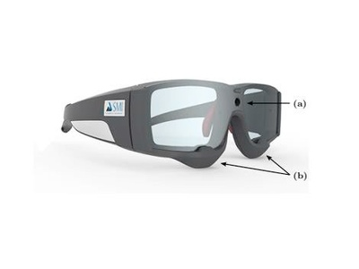<br>SMI eye tracking</td>
</tr>
<tr>
<td align="center" valign="top" width="33%">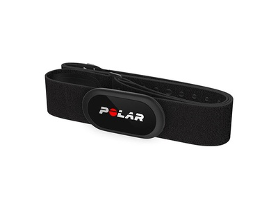<br>Polar H10</td>
<td align="center" valign="top" width="33%">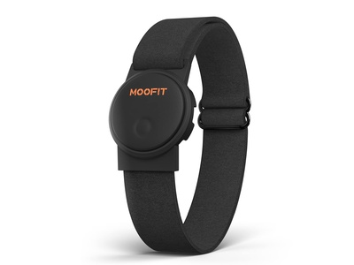<br>Moofit HW401</td>
<td align="center" valign="top" width="33%">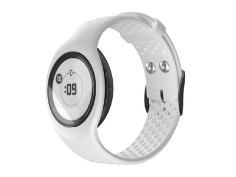<br>Empatica E4</td>
</tr>
<tr>
<td align="center" valign="top" width="33%">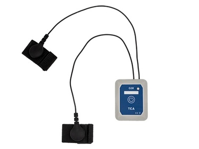<br>TEA T-SENS GSR</td>
<td align="center" valign="top" width="33%">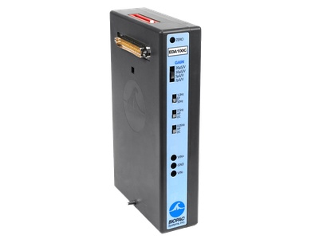<br>BIOPAC EDA</td>
<td align="center" valign="top" width="33%">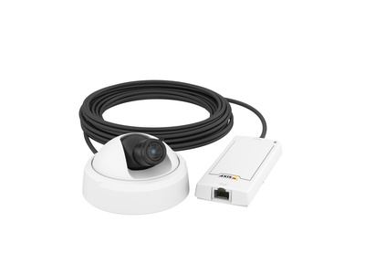<br>AXIS P1275</td>
</tr>
<tr>
<td align="center" valign="top" width="33%">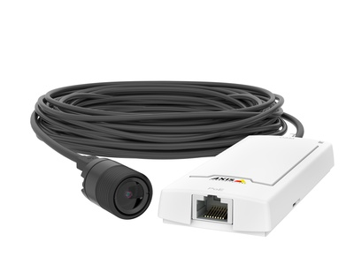<br>AXIS P1245</td>
<td align="center" valign="top" width="33%">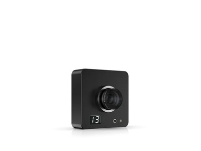<br>OptiTrack Slim X13</td>
<td align="center" valign="top" width="33%">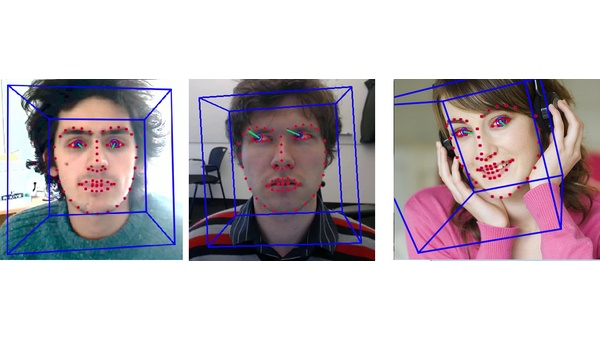<br>OpenFace</td>
</tr>
<tr>
<td align="center" valign="top" width="33%">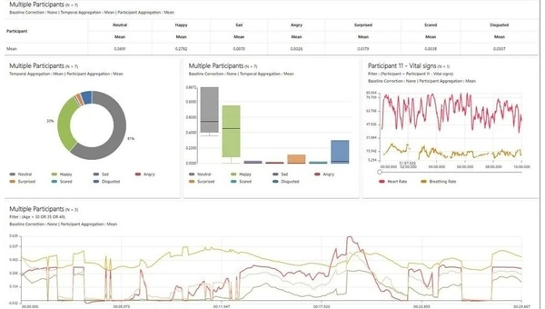<br>Noldus FaceReader</td>
</tr>
</table>

Channel mapping unverified. [Corrections](NOTICE.md#supported-corrections) · [Image credits](images/CREDITS.md)

## Setup

```bash
python -m pip install -e .
python -m scripts.derive --check
```

Wheels require `--data-dir /path/to/data`. [Commands](CONTRIBUTING.md).

| Stack | Tools |
| --- | --- |
| Runtime | Python ≥3.11, NumPy, pandas, Matplotlib |
| Verification | pytest, nbmake, Ruff, mypy |

## Limits

- **1 participant:** no classifier or diagnostic/population validation.
- **Clocks:** sensors/eyes naive; questionnaire UTC. Alignment unverified.
- **Measures:** gaze heuristic, interval samples; summary derivation missing.

## Sources and rights

**7 [reviews](docs/reviews)**; [corrections](NOTICE.md), [consent/privacy](DATA_ETHICS.md), [citation](CITATION.cff).

Code: [MIT](LICENSE). Authored data/docs: [CC BY 4.0](LICENSE-DATA). Instrument/media rights remain; instrument redistribution permission unestablished.

[Multimodal-Multisensor](https://github.com/urmeo/Multimodal-Multisensor) · [CalmSense](https://github.com/urmeo/CalmSense)
